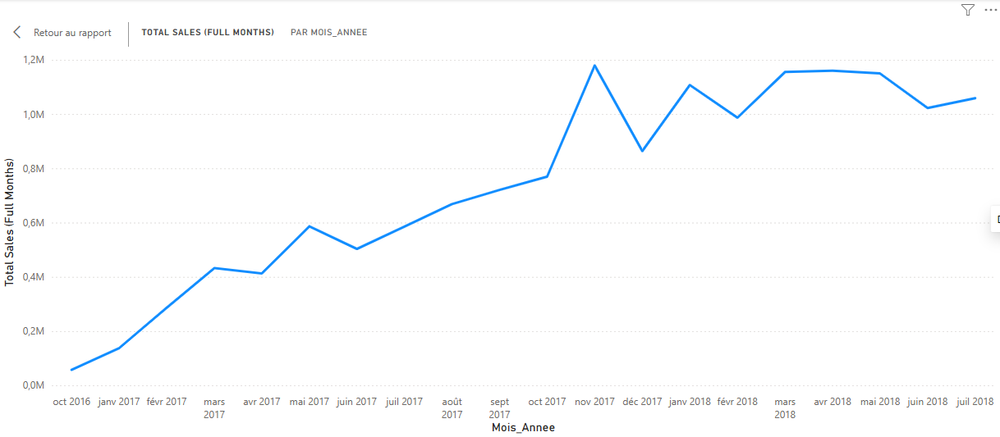

# 🏅 Olist Medallion Architecture

> **End-to-end analytics pipeline** for the Brazilian e-commerce dataset [Olist](https://www.kaggle.com/datasets/olistbr/brazilian-ecommerce) — built with PostgreSQL, dbt-style SQL transformations, and Power BI DAX.

**Stack:** PostgreSQL 15 · SQL (dbt-style) · Power BI Desktop · DAX · MCP Automation

---

## 📐 Architecture Overview

```
CSV Sources (C:\olist_data)
        │
        ▼
┌─────────────┐
│   BRONZE    │  Raw ingestion — 9 tables, 1 550 922 rows, no transformation
└─────────────┘
        │
        ▼
┌─────────────┐
│   SILVER    │  Typed & cleaned — TEXT→TIMESTAMP, DECIMAL casting, INITCAP/UPPER
└─────────────┘
        │
        ▼
┌─────────────┐
│    GOLD     │  Business-ready — fact table with pre-computed KPIs
└─────────────┘
        │
        ▼
┌─────────────┐
│  POWER BI   │  Semantic layer — Dim_Date, DAX measures, validated visual model
└─────────────┘
```

---

## 🗂️ Repository Structure

```
olist-medallion-architecture/
├── dbt_models/
│   ├── bronze/          # Raw CSV ingestion scripts
│   ├── silver/          # Typed & cleaned models (7 tables)
│   └── gold/            # Business fact table
├── dax_scripts/
│   ├── dim_date.dax     # Calendar table (2016–2018, 15 columns)
│   └── kpi_measures.dax # All KPI measures with embedded business logic
├── assets/
│   └── dashboard_overview.png   # ← Add your Power BI screenshot here
└── README.md
```

---

## 🔬 Data Integrity & Business Logic

### The Challenge — Partial Monthly Cycles

When building trend analyses on transactional e-commerce data, a critical but often overlooked problem emerges: **partial monthly cycles at the boundaries of the data collection window**.

The Olist dataset spans from September 2016 to October 2018, but the first and last months of collection are incomplete — only a handful of orders were recorded, making them statistically non-representative. Including these months in a time-series visualization produces two damaging artifacts:

1. **A false dip at the start of the series** — September 2016 shows only R$354 in revenue vs. R$1M+ in mature months, creating the misleading impression of a flat launch.
2. **A brutal cliff at the end of the series** — August–October 2018 show a sharp revenue drop that is purely a data collection artifact, not a real business signal.

Without treatment, these artifacts would lead a business analyst to draw incorrect conclusions about Olist's growth trajectory.

### The Solution — A Robust Semantic Layer

The fix was implemented across two complementary layers:

**Layer 1 — Normalized Date Dimension (`Dim_Date`)**

A critical technical bug was identified and resolved: `order_purchase_timestamp` stores full `DateTime` values (e.g., `2017-11-03 10:56:33`), while Power BI's `CALENDAR()` function generates dates at midnight (`2017-11-03 00:00:00`). This precision mismatch caused **99% of fact table rows to fail the join**, rendering all visuals empty.

The fix: a calculated column `order_date = DATE(YEAR, MONTH, DAY)` was added to the fact table to strip the time component and provide a clean join key — documented in [`dbt_models/gold/gold_fact_sales_performance.sql`](./dbt_models/gold/gold_fact_sales_performance.sql).

**Layer 2 — Intelligent DAX Measure (`Total Sales Full Months`)**

Rather than applying a static date filter on the visual (brittle, manual, not reusable), a self-documenting DAX measure was built that **encodes the business rule directly in the semantic layer**:

```dax
-- Total Sales (Full Months) — primary trend measure
VAR MontantBrut =
    SUM('gold fact_sales_performance'[total_order_value])
VAR IsAout2018 =
    SELECTEDVALUE('Dim_Date'[Annee])       = 2018
    && SELECTEDVALUE('Dim_Date'[Mois_Num]) = 8
RETURN
IF(
    IsAout2018 || MontantBrut < 10000,
    BLANK(),
    MontantBrut
)
```

This measure applies a **dual filter**:
- **Hard exclusion** of August 2018 — known incomplete month (R$1M revenue but partial data)
- **Automatic threshold** of R$10,000 minimum — any month below this is statistically insignificant and auto-filtered, **future-proofing** the measure against new boundary months without code changes

**Result:** 22 clean, fully comparable months from October 2016 to July 2018, presenting only periods where Olist's business was operating at full capacity.

| Month | Raw Revenue | Filtered Out? | Reason |
|-------|-------------|---------------|--------|
| Sept 2016 | R$354 | ✅ Auto | < R$10,000 threshold |
| Dec 2016 | R$19 | ✅ Auto | < R$10,000 threshold |
| Aug 2018 | R$1,003,308 | ✅ Hard | Known partial collection |
| Sept 2018 | R$166 | ✅ Auto | < R$10,000 threshold |
| Oct 2018 | R$0 | ✅ Auto | < R$10,000 threshold |

---

## 📊 Dashboard Insights



> *This dashboard demonstrates the stability of Olist's growth trajectory — made possible by the upstream data cleaning described above. Without the `Total Sales (Full Months)` measure, the trend line would show a misleading collapse at both ends of the time series, potentially triggering incorrect business decisions.*

### Key Metrics (validated in DAX — February 2026)

| KPI | Value |
|-----|-------|
| **Total Revenue (gross)** | R$ 15,843,553 |
| **Total Orders** | 99,440 |
| **Avg Delivery Delay** | 12.6 days |
| **Peak month** | November 2017 — R$ 1,179,143 (Black Friday Brazil) |
| **Clean analysis window** | October 2016 → July 2018 (22 months) |
| **Delivery improvement** | ~15 days avg (2017) → ~9–10 days (mid-2018) |

---

## 🏗️ Pipeline Details

### Bronze Layer — Raw Ingestion

| Table | Rows | Source |
|-------|------|--------|
| `bronze.customers` | 99,441 | olist_customers_dataset.csv |
| `bronze.orders` | 99,441 | olist_orders_dataset.csv |
| `bronze.order_items` | 112,650 | olist_order_items_dataset.csv |
| `bronze.order_payments` | 103,886 | olist_order_payments_dataset.csv |
| `bronze.order_reviews` | 99,224 | olist_order_reviews_dataset.csv |
| `bronze.products` | 32,951 | olist_products_dataset.csv |
| `bronze.sellers` | 3,095 | olist_sellers_dataset.csv |
| `bronze.geolocation` | 1,000,163 | olist_geolocation_dataset.csv |
| `bronze.product_category_translation` | 71 | product_category_name_translation.csv |
| **TOTAL** | **1,550,922** | |

### Silver Layer — Typed & Cleaned (7/7 tables)

| Table | Rows | Key Transformations |
|-------|------|---------------------|
| `silver.orders` | 99,441 | 5 columns TEXT→TIMESTAMP, NULL filter |
| `silver.order_items` | 112,650 | TIMESTAMP + DECIMAL(10,2) |
| `silver.customers` | 99,441 | zip::INT, INITCAP(city), UPPER(state) |
| `silver.sellers` | 3,095 | zip::INT, INITCAP(city), UPPER(state) |
| `silver.products` | 32,951 | EN category translation, DECIMAL dimensions |
| `silver.order_payments` | 103,886 | DECIMAL(10,2), filter ≥0, LOWER(TRIM) |
| `silver.order_reviews` | 99,224 | INT score 1–5, 2x TIMESTAMP |

### Gold Layer — Business Fact Table

| Table | Rows | Description |
|-------|------|-------------|
| `gold.fact_sales_performance` | 113,425 | LEFT JOIN orders × order_items + pre-computed KPIs |

**Computed columns:** `total_order_value`, `delivery_delay_days`, `order_month`, `order_year`, `order_month_num`, `order_date` *(Power BI join key)*

---

## ⚙️ Power BI Semantic Model

### Dim_Date — 15 columns, 1,096 rows
```
Date | Annee | Mois_Num | Mois_Nom | Mois_Nom_Court | Trimestre
Trimestre_Num | Annee_Trimestre | Mois_Annee | Mois_Annee_Tri
Semaine_Num | Jour_Semaine_Num | Jour_Semaine_Nom | Est_Weekend | Semestre
```

### Active Relationship
```
gold fact_sales_performance[order_date]  ──Many-to-One──▶  Dim_Date[Date]
```

### DAX Measures

| Measure | Expression | Format |
|---------|-----------|--------|
| `Total Sales` | `SUM([total_order_value])` | `#,##0.00` |
| `Total Sales (Full Months)` | Dual-filter business logic | `#,##0.00` |
| `Total Orders` | `DISTINCTCOUNT([order_id])` | `#,##0` |
| `Avg Delivery Delay` | `AVERAGE([delivery_delay_days])` | `#,##0.0` |

> 💱 **Currency note — all monetary values are expressed in Brazilian Real (R$ / BRL).**
> Olist is a Brazilian marketplace operating exclusively in Brazil. The source dataset contains no currency conversion — `price`, `freight_value`, and `total_order_value` are natively in BRL. No FX adjustment is required or applied anywhere in the pipeline.

---

## 🚀 How to Reproduce

```bash
# 1. Load Bronze layer (use psql \copy or your ETL tool)
psql -d postgres -f dbt_models/bronze/load_bronze.sql

# 2. Build Silver layer (run in order)
psql -d postgres -f dbt_models/silver/silver_orders.sql
psql -d postgres -f dbt_models/silver/silver_order_items.sql
psql -d postgres -f dbt_models/silver/silver_customers.sql
psql -d postgres -f dbt_models/silver/silver_sellers.sql
psql -d postgres -f dbt_models/silver/silver_products.sql
psql -d postgres -f dbt_models/silver/silver_order_payments.sql
psql -d postgres -f dbt_models/silver/silver_order_reviews.sql

# 3. Build Gold layer
psql -d postgres -f dbt_models/gold/gold_fact_sales_performance.sql

# 4. In Power BI Desktop
#    a) New Table → paste dax_scripts/dim_date.dax
#    b) New Measures → paste each measure from dax_scripts/kpi_measures.dax
#    c) Set relationship: fact[order_date] → Dim_Date[Date] (Many-to-One)
#    d) Sort Mois_Annee column by Mois_Annee_Tri
```

---

## 📄 License

MIT — Dataset source: [Olist Brazilian E-Commerce on Kaggle](https://www.kaggle.com/datasets/olistbr/brazilian-ecommerce)
